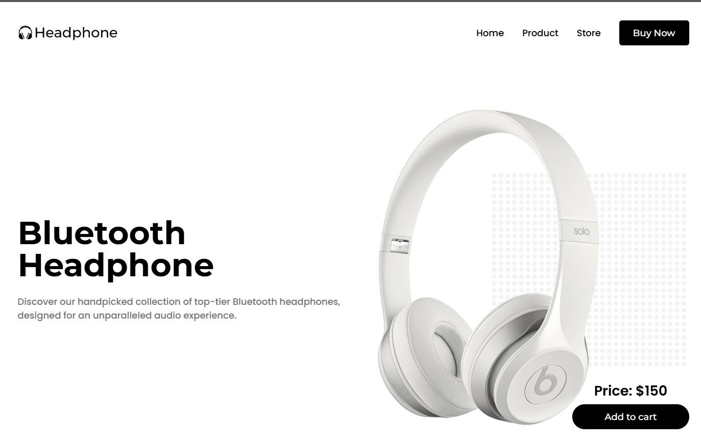

# Headphones Landing Page 🎯

## Overview

This project is a landing page for a headphones website. It showcases various models of Bluetooth headphones, highlighting their features and prices. The page is designed to be visually appealing and user-friendly, with a responsive layout that adapts to different screen sizes.

## Preview 📸

<p align="center">
  
</p>

## Features 🔥

- **Responsive Design**: The layout adjusts seamlessly to different screen sizes, ensuring a great user experience on both desktop and mobile devices.
- **Navigation Menu**: A toggleable navigation menu for easy access to different sections of the page.
- **Product Showcase**: A section dedicated to showcasing the features of the Bluetooth headphones.
- **Swiper Slider**: An interactive slider to display different headphone models available in the store.
- **Scroll Reveal Animations**: Smooth animations that reveal content as the user scrolls down the page.

## Technologies Used 🛠️

- **HTML**: For the structure of the page.
- **CSS**: For styling the page, including responsive design.
- **JavaScript**: For interactive elements like the navigation menu and Swiper slider.
- **Swiper.js**: For the slider functionality.
- **ScrollReveal.js**: For scroll animations.

## How to Use 📋

1. Clone the repository to your local machine.
2. Open the `Home.html` file in your web browser to view the landing page.
3. Navigate through the different sections using the navigation menu.
4. Interact with the Swiper slider to view different headphone models.

## Project Structure

```
/Headphones Landing Website
│
├── assets
│   ├── header.png
│   ├── header-bg.png
│   ├── logo-dark.png
│   ├── logo-white.png
│   ├── product.png
│   ├── store-1.png
│   ├── store-2.png
│   ├── store-3.png
│   ├── store-4.png
│   ├── store-5.png
│   ├── store-6.png
│
├── css
│   └── styles.css
│
├── js
│   └── script.js
│
├── Home.html
└── README.md
```

## Credits

- **Design and Development**: Ashish Sunil Thomas
- **Icons**: Remix Icon
- **Slider**: Swiper.js
- **Animations**: ScrollReveal.js

## How to use this project 💻

```bash
#1. clone this project
~ git clone https://github.com/ashishthomas/Headphones-Landing-Website.git

#2. Open the index.html file in your browser
~ open index.html

#3. To display the clock in your browser
~ live server

#4. Enjoy!

```

## Disclamer ❗️

I am simply an Employee passionate about Front-end and the intersection of code and design, I always try to do courses and projects during my free time, so I can learn more and more. I am always open to suggestions and feedback.

## Contributing 💡

Pull request are welcome but please open an issue and discuss what you will do before 😊

## Author ✒️

**Ashish Sunil Thomas**

## Like this project? 💖

Give a ⭐️ if you like this project!

## License

This project is licensed under the MIT License.
